# EmoC

> 第三方、免费的 Android 网易云音乐客户端，用原生移动界面呈现网易云音乐账号下的日常听歌体验。 
> A third-party, free Android music client with a native mobile-first UI.

喜欢的话请点上一个 star，非常感谢！！！

[下载最新版 APK / Download](https://github.com/yufenghub/EmoC/releases/latest) · [更新日志 / Changelog](CHANGELOG.md)

## 最新更新 / What's New

`1.0.12` 汇总了 `1.0.8` 之后的更新：华丽液态玻璃外观、镂空/实心卡片、分区域无字模式、播放页实时预览与字号/按钮大小调节、本地音乐、最近播放、自定义均衡器、无缝播放与交叉淡化、网络音质策略，以及首页长列表性能优化。Apple Music 样式的歌词现在根据实际可用高度和文字大小自动调整显示行数。

Version `1.0.12` brings liquid-glass styling, outline/solid cards, per-page text visibility, live player previews and sizing controls, local music, listening history, a custom equalizer, playback transitions, network-aware quality settings, and lazy home lists. Apple Music-style lyrics now adapt their visible row count to the available height and text size.

## 项目说明 / About

EmoC 是一个 Flutter + Kotlin Android 客户端，聚焦首页推荐、歌单、搜索、播放控制、歌词、桌面歌词、动态取色和系统媒体控件。它不是音乐服务端，也不托管音乐、歌词或封面内容。

EmoC is a Flutter + Kotlin Android client focused on recommendations, playlists, search, playback controls, lyrics, desktop lyrics, dynamic color, and Android media controls. It is not a music backend and does not host music, lyrics, or cover art.

EmoC 依赖用户自己的网易云音乐账号与 `music.163.com` 官网会话。应用内部分功能会调用网易云音乐网页端接口以及第三方社区常见的兼容接口路径；这些接口并非 EmoC 提供，也不是网易云音乐开放平台商业授权 API。EmoC 不提供绕过会员、版权或地区限制的能力。

EmoC depends on the user's own NetEase Cloud Music account and `music.163.com` website session. Some features call NetEase Cloud Music web endpoints and community-known compatibility-style endpoint paths. These endpoints are not provided by EmoC and are not commercial APIs authorized by the NetEase Cloud Music Open Platform. EmoC does not provide any ability to bypass membership, copyright, or regional restrictions.

## 使用警告 / Usage Warning

> [!WARNING]
> EmoC 是第三方、免费、非官方项目。它不隶属于网易云音乐，也未获得网易云音乐官方授权、赞助、认可或合作。
>
> EmoC is third-party, free, and unofficial. It is not affiliated with, endorsed by, sponsored by, authorized by, or officially connected to NetEase Cloud Music.

- 请遵守所在地法律法规、网易云音乐服务条款和相关内容权利要求。 
  Comply with applicable laws, NetEase Cloud Music service terms, and content rights.
- 音乐、歌词、封面、账号、商标和服务均归对应权利方所有。 
  Music, lyrics, cover art, accounts, trademarks, and services belong to their respective owners.
- 第三方客户端可能带来账号风控、功能失效、登录失败、播放失败、账号限制或封禁等风险。 
  Third-party clients may involve account risk control, feature breakage, login failures, playback failures, account restrictions, or bans.
- 请仅从可信渠道获取安装包；不要安装未知来源的二次打包版本。 
  Install only from trusted channels and avoid unknown repackaged APKs.
- 本项目仅供个人学习、互操作研究和非商业使用，禁止用于商业、侵权或非法用途。 
  This project is for personal learning, interoperability research, and non-commercial use only. Commercial, infringing, or illegal use is prohibited.
- 安装后首次打开可能出现加载失败，通常删除后台后重新进入即可恢复。 
  The first launch after installation may fail to load. Removing the app from recents and reopening usually resolves it.

## 功能特性 / Features

- 首页每日歌曲推荐 
  展示账号相关的每日歌曲推荐，支持下拉刷新、缓存恢复和歌曲行按需加载。搜索支持历史记录、实时建议与结果切换。

- 歌单与本地搜索 
  展示喜欢的音乐和用户创建的歌单，歌单内支持搜索、懒加载、多选、排序与批量管理。歌单封面跟随第一首歌曲。

- 本地音乐 
  支持选择本地文件或文件夹、建立本地歌单、搜索本地歌曲，并读取配套 LRC 歌词。

- 播放控制 
  支持播放/暂停、上一首、下一首、进度、音量、循环模式、收藏、播放列表和 VIP 不可播提示/跳过策略。

- 歌词体验 
  支持专注歌词、网易云风格唱片和 Apple Music 风格封面三种播放器。当前歌词高亮、译文弱化，歌词随播放平滑滚动；Apple Music 样式根据可用高度、歌词字号与系统文字缩放调整行数和行距。

- 播放页自定义 
  支持真实界面实时预览、按钮显隐、长按拖拽换位、按钮大小、歌词字号，以及背景和动效调节。歌词字号同时根据屏幕大小自适应。

- 播放与音频设置 
  支持无缝连续播放、0–8 秒交叉淡化、同时播放，以及五频段自定义均衡器和原声/低音/人声/流行/摇滚/电子预设。音量均衡使用歌曲接口返回的增益与峰值信息，实际效果取决于歌曲数据。

- 网络与音质 
  可分别设置 Wi-Fi 和移动网络的播放音质、预加载与移动网络播放策略，并在请求失败时按设置回退音质。可用音质仍取决于账号权限与歌曲来源。

- 桌面歌词 
  支持悬浮窗权限申请、透明度、背景色、歌词色、字号、字重、单句/多句、锁定、居中线约束、前台自动隐藏和动态取色。

- 系统媒体集成 
  支持 Android 通知栏/控制中心媒体状态、桌面播放小组件、耳机/蓝牙断开暂停、后台播放保活和系统播放状态恢复。

- 个性化外观 
  支持简约与华丽液态玻璃外观、镂空/实心卡片、卡片边框开关，以及浅色/深色/跟随系统主题。背景可选择亮暗优先或封面优先，切歌时平滑过渡；文字、图标、进度条可分别动态取色或选择固定颜色。

- 无字模式 
  支持首页、歌单、设置和歌词区域分别自定义，并实时预览。可隐藏页面/分组标题、搜索栏、本地音乐入口、新建歌单按钮等内容。

- 最近播放与搜索历史 
  支持最近播放列表和搜索历史的保存、查看、清理与记录开关。

- 缓存与恢复 
  缓存推荐、歌单、播放列表、播放卡片、主题偏好和循环状态，提升启动后的恢复体验。

## 界面展示 / Screenshots

以下是 `1.0.12` 在 MuMu 上截取的实际运行界面，展示华丽外观和镂空卡片。

Actual `1.0.12` screenshots captured in MuMu, showing liquid-glass styling and outline cards.

| 首页 / Home | 歌词 / Lyrics |
| --- | --- |
| 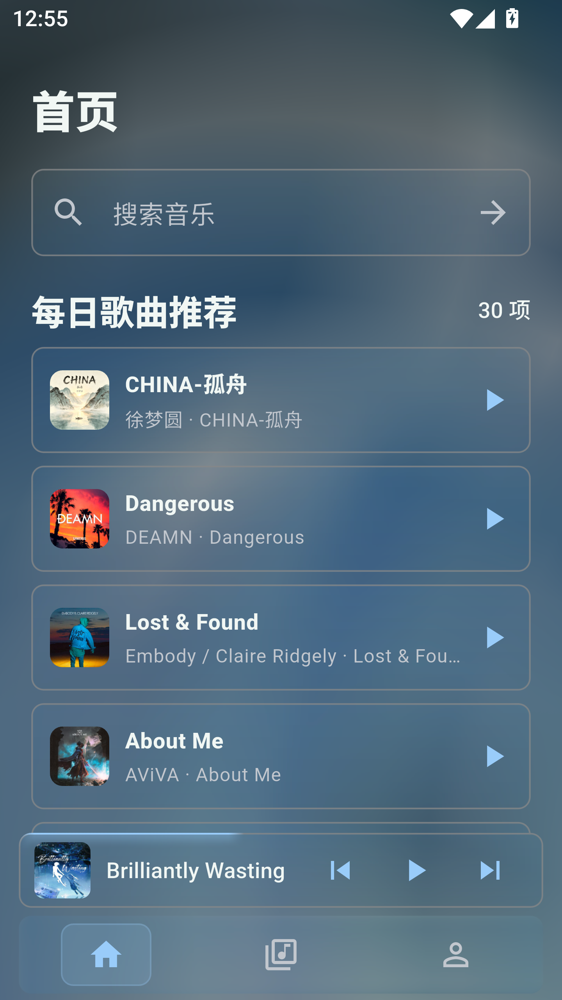 | 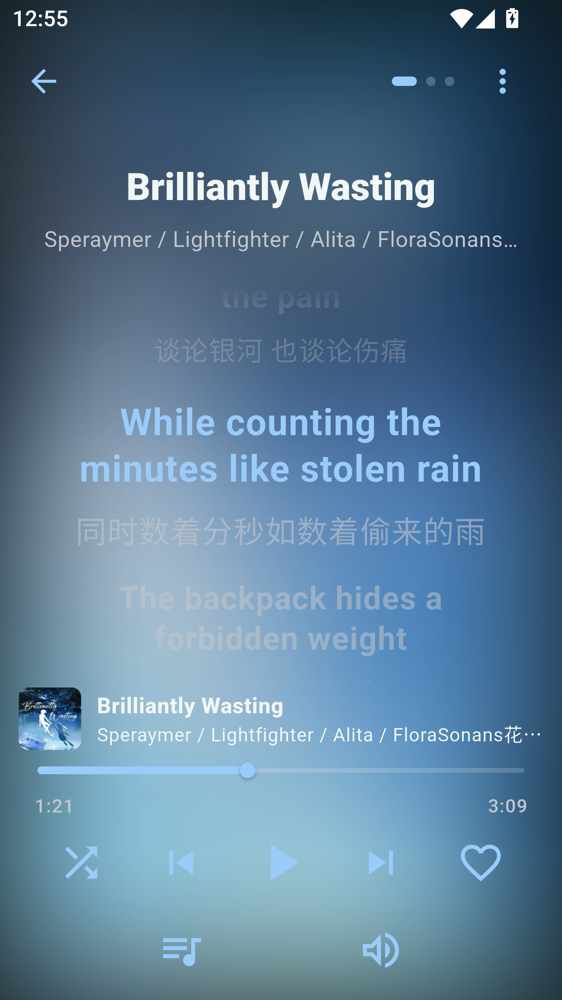 |

| 网易云风格 / Record Player | Apple Music 风格 / Artwork Player |
| --- | --- |
| 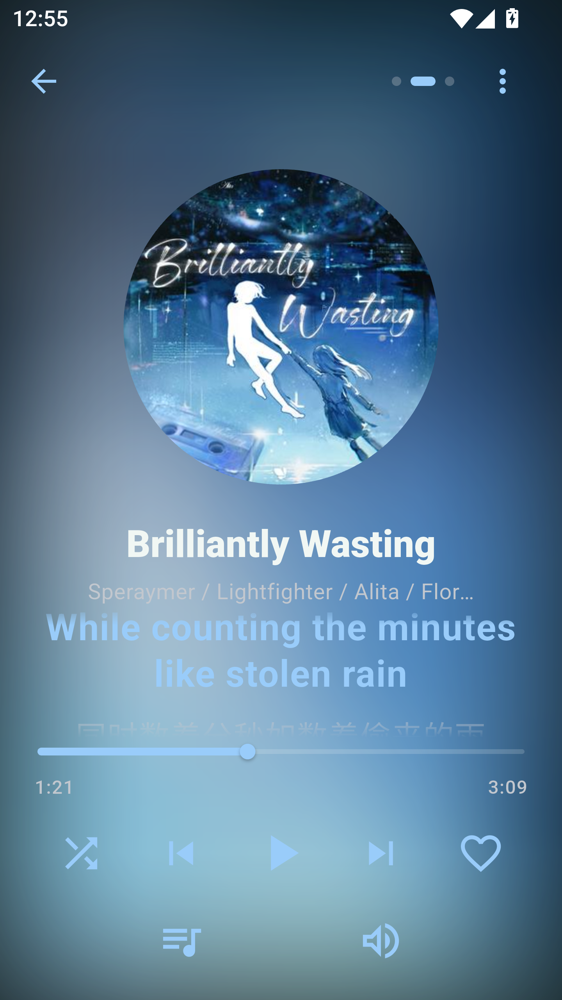 | 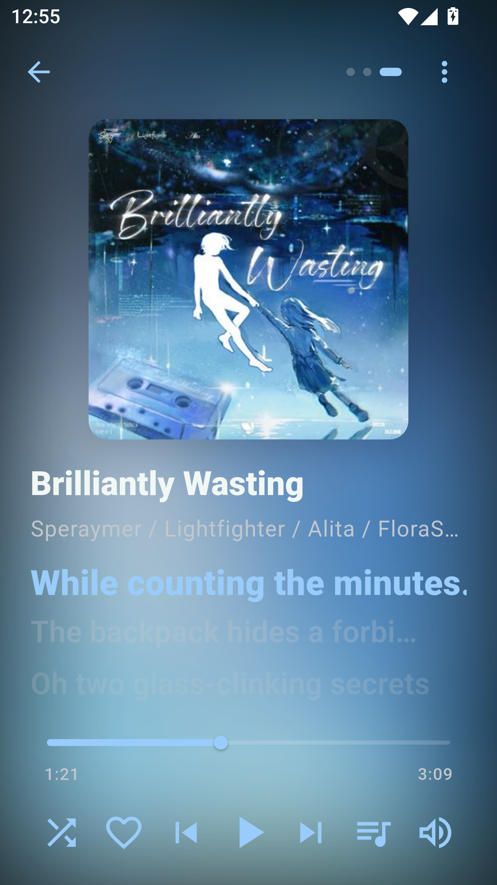 |

| 歌单 / Playlists | 歌单详情 / Playlist Detail |
| --- | --- |
| 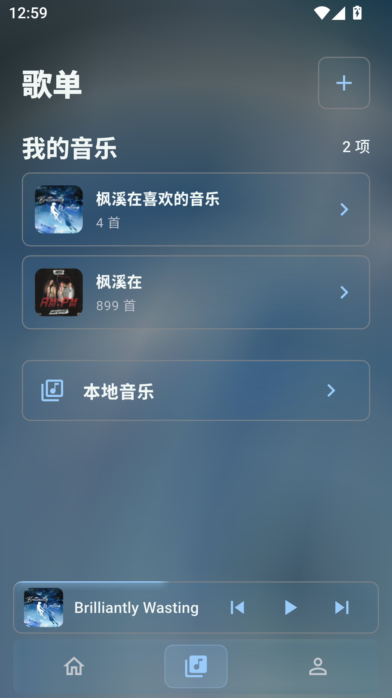 | 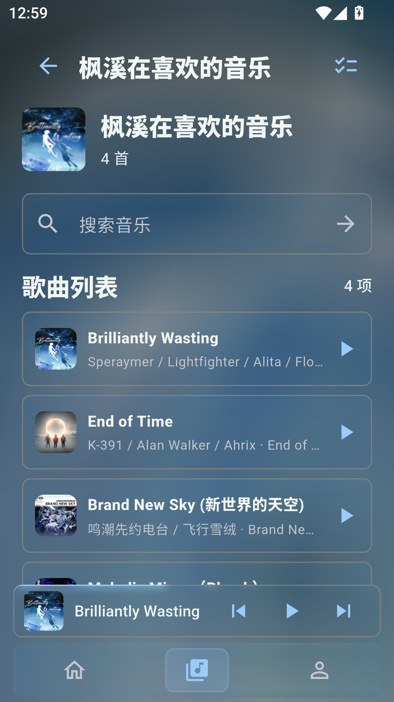 |

| 我的 / Mine | 设置 / Settings |
| --- | --- |
| 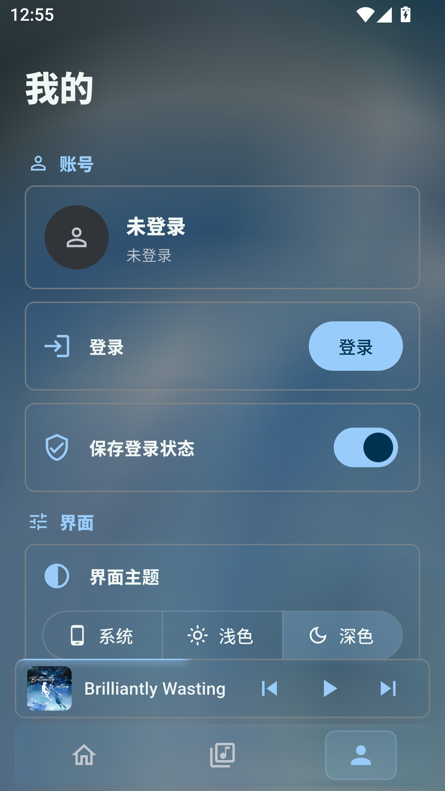 | 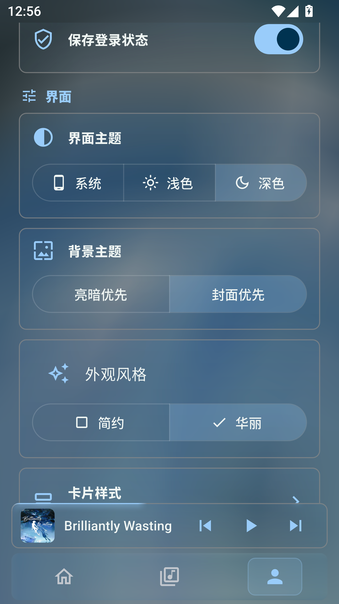 |

| 播放页自定义 / Player Customization | 卡片样式 / Card Style |
| --- | --- |
| 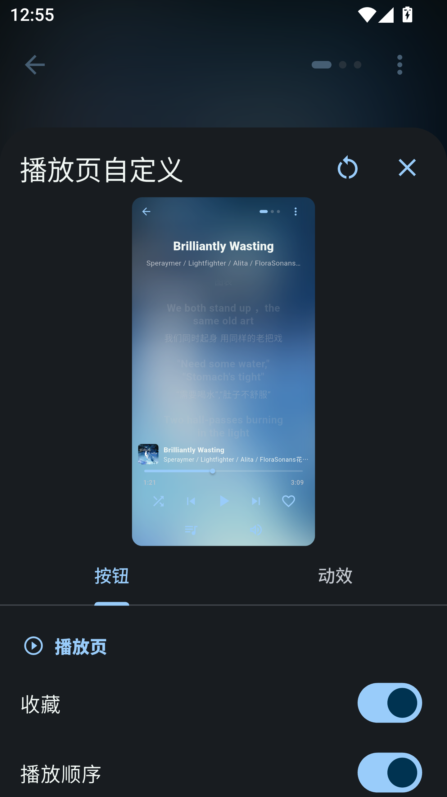 | 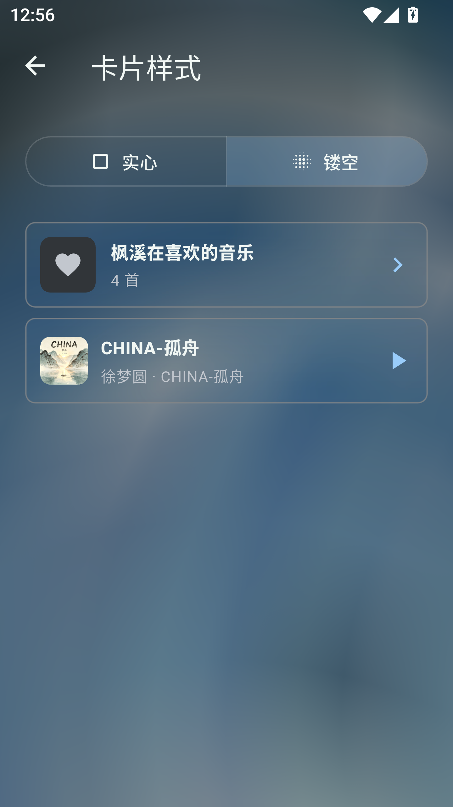 |

| 自定义均衡器 / Equalizer | 桌面歌词设置 / Desktop Lyrics Settings |
| --- | --- |
| 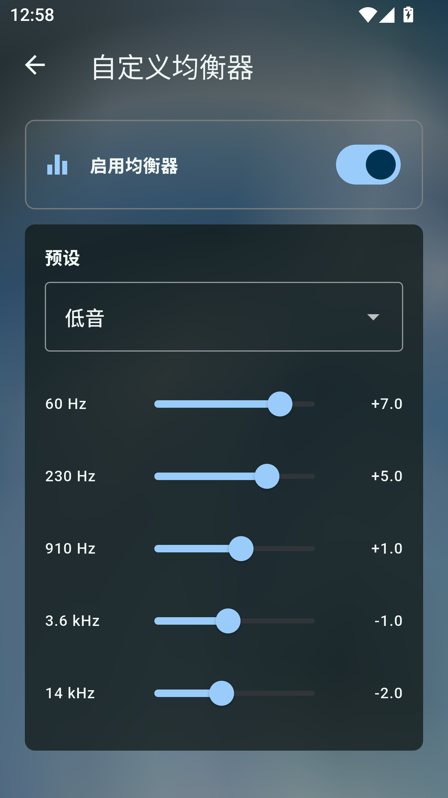 | 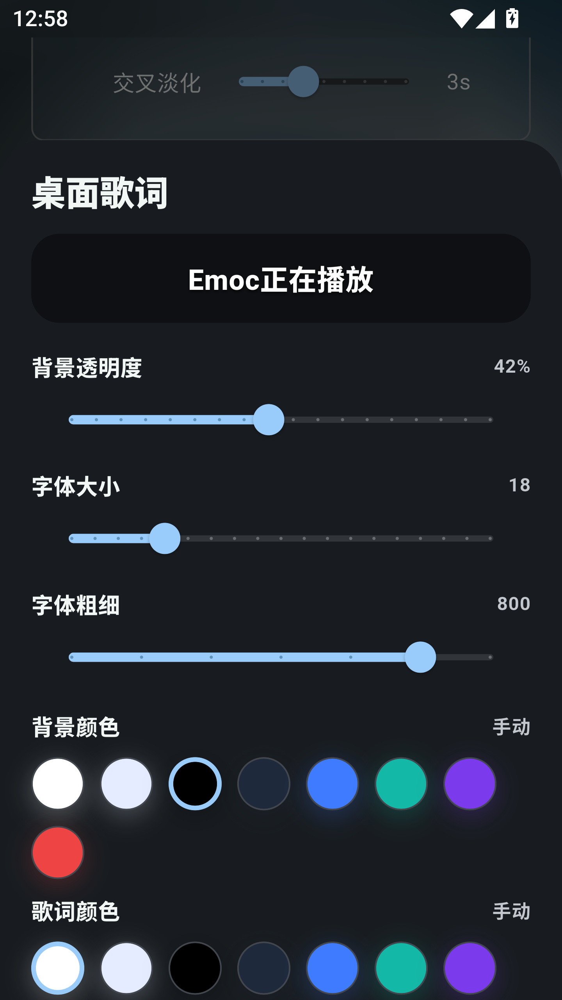 |

## 文档 / Documents

- [隐私说明 / Privacy Policy](PRIVACY.md)
- [免责声明 / Disclaimer](DISCLAIMER.md)
- [更新日志 / Changelog](CHANGELOG.md)
- [项目说明 / Notice](NOTICE)

## 免责声明 / Disclaimer

本项目部分功能依赖网易云音乐官网会话、网页端接口以及第三方社区常见的兼容接口路径，仅供个人学习研究和互操作验证使用，禁止用于商业及非法用途。

项目开发者承诺遵守相关法律法规，并不会利用本项目进行违法活动。因使用、修改、分发或再分发本项目而引起的任何纠纷、账号风险、版权风险、服务条款风险、直接或间接损失，均由使用者自行承担。项目开发者不承担由此产生的任何责任，并保留追究恶意违法使用行为的权利。

请使用者在使用本项目时遵守相关法律法规、平台服务条款和内容权利要求，不要将本项目用于任何商业、侵权或非法用途。如有违反，一切后果由使用者自负。本项目按现状提供，不对第三方服务、接口、内容、登录、播放、歌词或封面的可用性做出任何保证。

感谢理解。

This project depends on the NetEase Cloud Music website session, web endpoints, and community-known compatibility-style endpoint paths for some features. It is provided only for personal learning, research, and interoperability validation. Commercial and illegal use is prohibited.

The developers comply with applicable laws and do not use this project for illegal activity. Users are solely responsible for any disputes, account risks, copyright risks, service-term risks, or direct/indirect losses caused by using, modifying, distributing, or redistributing this project. The developers assume no liability and reserve the right to pursue malicious illegal use.

See [DISCLAIMER.md](DISCLAIMER.md) for the full disclaimer.

## 鸣谢 / Acknowledgements

- [qier222/YesPlayMusic](https://github.com/qier222/YesPlayMusic)：开源音乐客户端项目，提供了客户端形态和交互方向上的参考。
- [SPlayer-Dev/SPlayer](https://github.com/SPlayer-Dev/SPlayer)：开源播放器项目，提供了仓库展示、文档组织和播放器体验上的参考。
- [WXRIW/Lyricify-Backgrounds](https://github.com/WXRIW/Lyricify-Backgrounds)：封面流动背景的参考与移植来源，许可和修改说明见 [第三方声明](third_party/lyricify-backgrounds/NOTICE.txt)。
- [liquid_glass_widgets](https://pub.dev/packages/liquid_glass_widgets)：液态玻璃组件，许可说明见 [第三方声明](third_party/liquid-glass-widgets/THIRD_PARTY_NOTICES.txt)。

## 开源许可 / Open Source License

EmoC 使用 GNU General Public License v3.0 or later，即 `GPL-3.0-or-later`。

你可以在遵守 GPL-3.0-or-later 条款的前提下使用、复制、修改和分发本项目。分发修改版本时，应保留许可证、版权声明和免责声明，并按 GPL 要求提供对应源码。

EmoC is licensed under the GNU General Public License v3.0 or later, `GPL-3.0-or-later`.

You may use, copy, modify, and distribute this project under the terms of GPL-3.0-or-later. When distributing modified versions, keep the license, copyright notices, and disclaimer, and provide corresponding source code as required by the GPL.

见 [LICENSE](LICENSE) 和 [NOTICE](NOTICE)。

See [LICENSE](LICENSE) and [NOTICE](NOTICE).
